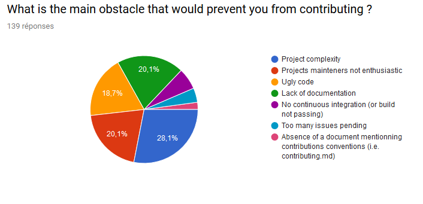

# Projet 1 : How to improve contributors onboarding

## Auteurs

Nous sommes quatre étudiants en dernière année de Sciences Informatiques à Polytech Nice-Sophia en spécialité Architectures Logicielles :

* BOUNOUAS Nassim &lt;nassim.bounouas@etu.unice.fr&gt;
* CANCELA VAZ Joël &lt;joel.cancela-vaz@etu.unice.fr&gt;
* MORTARA Johann &lt;johann.mortara@etu.unice.fr&gt;
* ROUSSEAU Nikita &lt;nikita.rousseau@etu.unice.fr&gt;

## I. Les contributeurs, la vraie ressource de l'open source

Le sujet ayant retenu notre attention concernait le projet XWiki. Le sujet initial, était subdivisé en deux questions :

* Comment améliorer la qualité de code chez XWiki ?
* Comment améliorer l'_onboarding_ des contributeurs chez XWiki ?

En partant de ces sujets nous avons redéfini une nouvelle problématique : Comment introduire une dynamique de contribution dans un projet open source et pérenniser sa communauté ?

L'intérêt principal de cette recherche réside dans l'importance de la communauté dans le monde open source. De nombreux projets open source constituent le socle de l'informatique moderne que ce soit des éditeurs de texte, aux outils de _build_ jusqu'aux bibliothèques "habituelles" : Visual Code Studio, Maven, Gradle, JUnit, Mockito, Apache Kafka, Jenkins, Docker...

L'ensemble de ces projets constituent le paysage technologique de notre époque et sont devenus incontournables pour la plupart des développeurs. Derrière ces projets et organisations se cachent souvent des centaines de contributeurs, rémunérés ou non par des sociétés pour participer à l'avancée desdits projets. Le noyau Linux peut être considéré comme le projet open source ayant le plus impacté le monde de l'informatique ces 30 dernières années. Compte tenu de son usage, le noyau Linux regroupe de nombreux contributeurs professionnels \(_i.e._ rémunérés par une entreprise pour contribuer\).

Qu'en est-il des projets plus petits ? Comment peuvent-ils faire grandir leur communauté ? Comment peuvent-ils inciter les contributeurs à participer activement et sur le long terme au développement de leur projet ?

## II. Collecte d'informations

Nous avons ciblé 4 projets de taille comparable à XWiki afin d'en étudier les contributions :

* JUnit 5
* Mockito
* Hibernate ORM
* Log4j2

Afin de cadrer notre recherche nous avons du définir la notion de **contributeur**. Nous avons donc restreint la définition de contributeur à toute personne ayant proposé un _commit_ accepté sur la branche principale \(master\) du projet.

Un entretien avec Vincent Massol nous a permis d'ajouter une nuance dans notre analyse puisque l'ensemble des projets retenus reposent tous sur une communauté alors qu'XWiki est maintenu par la société XWiki SAS. Ce point est néanmoins nuancé par l'implication d'industriels dans l'ensemble de ces projets \(condition préalable à notre sélection\).

Nous avons de plus cherché des articles de recherche traitant de l'open source et des dynamiques de contributions. Parmi les papiers ayant attiré notre attention, ceux ayant eu un réel intêrét :

* Papier 1
* Papier 2
* Papier 3

Nous souhaitions initialement réaliser un sondage en ligne afin de pouvoir confronter nos résultats à l'avis d'un groupe plus ou moins grand de développeurs. Nous avons décidé de réaliser ce sondage en fin d'analyse afin d'une part de ne pas être guidé dans nos recherches par les résultats de ce dernier et d'autre part pour nous permettre d'affiner les questions. En effet, l'étude des métriques tangibles nous a conduit à des métriques subjectives ne pouvant pas être mesurées autrement qu'en interrogeant les contributeurs.

## III. Une chambre bien rangée est-elle plus accueillante ?

En débutant cette étude chaque membre de l'équipe a posé sur le papier ses impressions et ses préjugés. Nous nous sommes alors rendu compte que nous arrivions à la même hypothèse : pour nous, les principaux facteurs permettant d'attirer des contributeurs dans un projet open source résidaient dans la bonne tenue de celui, une bonne documentation et des régles de contributions mises en avant et détaillées.

En partant de cette hypothèse nous avons défini des métriques pouvant, d'après nous, la valider ou l'invalider.  Les métriques retenues étaient donc :

* Présence d'un README.md détaillé avec ces informations :
  * Présence d'une section "Getting started" ou ce qui s'en rapproche afin de proposer un point d'entrée à la contribution.
  * Présence d'une section "Getting help" qui détaille comment contacter les mainteneurs du projets en cas de questions.
  * Présence de badges \(ou [_shields_](https://shields.io/)_\)_ montrant l'état du _build_, la couverture de tests ou d'autres informations utiles.
  * Présence d'une section "How to build" ou ce qui s'en rapporche détaillant comment construire la solution localement.
* Présence d'exemples de code.
* Présence d'un CONTRIBUTING.md qui définit les conventions de nommages, les messages de _commits_, etc.
* Présence d'un outil d'intégration continue \(Travis CI, Jenkins, etc.\)
* Présence d'une documentation tenue à jour
* Nombre de jours depuis la dernière mise à jour de la documentation, si disponible
* Temps moyen de réponse aux _issues_
* Nombre de _commits_
* Nombre de contributeurs
* Analyse des contributeurs et de leur contributions

## IV. Analyse des résultats et Conclusion

### JUnit5

JUnit5 est un _framework_ de test unitaire, un des plus utilisés pour le langage Java. Cette version majeure 5 succède à la version 4 et apporte beaucoup de nouvelles fonctionnalités majeures. Cette version 5 est aussi une refonte du framework et par conséquent se trouve sur un _repository_ à part.

#### Analyse des KPI \(analyse faite le 27 Janvier 2019\)

* Présence d'un README.md :
  * Présent et est assez complet, contient les parties \(_Contributing, Getting Help, Continuous Integration Builds, Code Coverage_ et _Building from Source_\).
  * Il est possible de discuter avec la team de développement sur Gitter ou indirectement via StackOverflow.
* Méthode de contribution :
  * Chercher les issues taguées avec "_up-for-grabs_" \(qui sont très peu nombreuses, 10 seulement au moment la vérification\)
* Badges :
  * Travis.CI et Appveyor, tous les deux au vert au moment de la vérification avec le label "_Build passing_"
* Présence d'une intégration continue sur Travis.CI et Appveyor.
* Présence d'un CONTRIBUTING.md
  * Présent et détaille très bien les conventions de nommage et formatage du code.
* Exemples de code :
  * Présent sur un autre _repository_, lien référencé dans le README.md
* Présence de Javadoc, à jour et mise à jour automatiquement à chaque _commit_
* Temps moyen de réponse aux issues: environ 1h
* Nombre de commits sur master : 5417 au moment de la vérification
* Nombre de contributeurs : 95

JUnit5 semble remplir la très grande majorité de nos critères pour être un projet attirant, voyons maintenant avec l'analyse des contributions si le projet est porté par les membres de l'équipe JUnit ou par sa communauté.

#### Analyse des contributions

Le projet a démarré en octobre 2015, comporte plus de 5400 _commits_ et 95 contributeurs.

Parmis ces contributeurs :

* 44 contributeurs avec 1 _commit_ \(46,3%\)
* 43 contributeurs avec 2 à 16 _commits_ \(45,3%\)
  * dont seulement 6 contributeurs avec au moins 2 _commits_ espacés d’au moins une semaine.
  * et un membre de Neo4j \(un autre projet Java de gestion de base de données basé sur les graphes\).
* 8 principaux contributeurs: \(8.4%\)
  * Top 8: un compte nommé “junit-buildmaster” qui sert pour des opérations de gestion du code \(indentation de code, renommage de variables, mise à jour de _headers_ dans la documentation\).
  * Top 7: un contributeur lambda qui ne contribute plus depuis 2 ans \(dernier _commit_ octobre 2017\)
  * Top 6 : un autre contributeur lambda qui ne contribue plus depuis janvier 2017
  * Top 5 : un contributeur lambda encore très actif \(dernier _commit_ 24 janvier 2019 au moment de la vérification\)
  * Top 4 : un membre de JUnit, son premier commit a été plus tardif que les autres membres, aussi très actif \(dernier _commit_ 14 janvier 2019\)
  * Top 3: un contributeur lambda, grosse contribution entre fin 2015 et 2016, depuis plus rien.
  * Top 1 et 2: deux membres de JUnit qui ont contribué au projet depuis le début et qui continuent.

Une recherche sur le [site portfolio](https://blog.johanneslink.net/2016/04/16/goodbye-junit-5/) d'un des 8 contributeurs a montré que les contributeurs 2, 3, 5 et 7 se connaissent et ont travaillé en équipe ensemble, et que suite à des conflits dans l’équipe ils sont cessés de travailler ensemble. Les contributeurs 3, 5 et 7 ne sont donc pas si “étrangers” au projet. Il semble donc qu’il n’y ait qu’un seul “vrai” contributeur externe au projet dans les 8 principaux contributeurs, le contributeur 6, qui ne contribue plus.  
Le projet est donc porté par les membres de l'équipe JUnit en très grande majorité.

Une KPI qui n'a pas vraiment été prise en compte est la complexité du projet, en effet, le projet JUnit5 est composé d'une vingtaine de modules Java et le coût d'entrée dans le projet semble être assez conséquent, même les issues "_up-for-grabs_" sont parfois incompréhensibles pour un néophyte.

De plus, en regardant certains commentaires de certains membres de JUnit à l'égard de nouveaux contributeurs qui demandent s'il peuvent essayer d'implémenter une fonctionnalité ne sont pas très encourageants. Ce qui a pour effet de créer une sorte de syndrome de la tour d'ivoire. En tout cas, on relève un certain manque de tacte.

#### Analyses des contributions

Pour confirmer mes propos je me suis rendu sur le **Gitter** de l'équipe JUnit, me suis fait passé pour un nouveau contributeur qui aimerait contribuer mais qui ne sait pas par où commencer. Le résultat est assez décevant... les membres de l'équipe JUnit ne m'ont pas répondu et ont continué leur discussion. C'est un contributeur externe qui m'a aiguillé sur une de ses _issues_ qu'il a fait il y'a quelques années et qui s'est proposé de m'aider si j'en avais besoin.

Avec tous ces exemples, on en déduit que les contributions externes ne semble pas être une priorité pour l'équipe.

### Mockito

#### Analyse des KPI \(analyse faite le 10 Février 2019\)

* Présence d'un README.md :
  * Présent et à jour. Le document contient les grandes lignes permettant l'accueil dans le projet \(Version courante, liens vers les documentations fonctionnelles et techiques et les différents moyens de contacter l'équipe\)
  * Il est clairement écrit que le projet désire des contributions externes et tout est fait pour qu'un nouvel entrant puisse construire le projet et proposer des modifications/envoyer du code.
* Exemples de code :
  * Présent sur le site officiel du projet
* Méthode de contribution :
  * Sur les 239 tickets ouverts, 14 portent un label "please contribute" et sont adaptés à un nouveau contributeur
  * Un fichier CONTRIBUTING.md est présent et commence par les différents endroits où un individu externe au projet peut entrer en contact avec la communauté pour obtenir du support. Ce fichier décrit clairement les deux branches principales du projet \(version courante et version à venir\). Les attentes en terme de pull request \(commits, coding style et procédures\) y sont décrites.
* Présence d'une intégration continue sur Travis.CI et Codecov.
* Badges \(ou _shields_\) :
  * Travis.CI \(build : passing\)
  * Codecov : Couverture en test unitaire de 88%
  * Versions : Licence, Release notes, Dernière version téléchargeable \(binaire et maven\), dernière version documentée
* Présence de Javadoc, à jour et mise à jour automatiquement à chaque _commit_
* Temps moyen de réponse aux issues: environ ??
* Nombre de commits sur master : ??? au moment de la vérification
* Nombre de contributeurs : ???

#### Analyse des contributions

Lors de l' analyse des contributions sur le projet Mockito, on se rend assez rapidement compte de l'importance du fondateur. Szczpan Faber qui se fait appeler "Mockito Guy" sur Github et Twitter représente à lui seul 75% des commits sur la branche principale de la nouvelle version du framework.

Le second contributeur, Brice Dutheil, représenteb 11% des commits, et les contributeurs placés de la 3ème à la 7ème place représentent chacun entre 1 et 2.5 % des commits disponibles sur la branche principale. Les 131 autres contributeurs ont tous un nombre de commits trés largement inférieurs à 1%.

### Hibernate

Le projet Hibernate est composé de 39 dépôts. Nous avons choisi de concentrer notre étude sur le dépôt de _Hibernate ORM_.

#### Analyse des KPI

* Présence d'un README.md :
  * Contient les consignes de base permettant de construire le projet.
  * Propose une redirection vers le CONTRIBUTING.md.
* Méthode de contribution :
  * Un fichier CONTRIBUTING.md est présent. Il apporte des précisions sur les licences utilisées dans le projet et fournit un guide des étapes à réaliser pour pouvoir contribuer au projet.
  * Les issues sont gérées avec un JIRA externe. Les premières réponses sont de l'ordre de quelques heures.
* Badges :
  * Jenkins : _build passing_
  * LGTM \(qualité du code\) : A
* Intégration continue : Jenkins, LGTM
* Documentation : présence d'une AsciiDoc sur le dépôt du projet.
* Moyen de contacter l'équipe de développement : oui, sur le site de Hibernate \([http://hibernate.org/community/](http://hibernate.org/community/)\)
* Nombre de contributeurs au moment de l'étude : 346
* Nombre de commits sur `master` au moment de l'étude : 9436

#### Analyse des contributions

En analysant la répartitions des commits sur la branche `master` du projet, nous pouvons dégager plusieurs profils de contributeurs :

* 1 → 2 : contributeurs réguliers
* 3 → 10 : contributeurs ayant bien contribué sur une période
* 11 → 50 : contributions occasionnelles
* 51+ : contribution unique

Il est intéressant de remarquer que les 18 premiers contributeurs font partie de l'organisation GitHub _Hibernate_. Hibernate étant développé par JBoss \(qui est une division de RedHat\), nous pouvons supposer que ces contributeurs sont rémunérés pour contribuer au projet. Le premier contributeur, Steve Ebersole, est _project lead_ de Hibernate ORM.

De par la quantité de contributions produite par les développeurs de l'organisation _Hibernate_, moins de 20% des contributeurs ont produit et maintiennent plus de 80% du projet \(les 19 premiers contributeurs, donc 5% des contributeurs\).

**Conclusion :** malgré le fait que la communauté soit assez présente pour remonter les bugs, ce sont le plus souvent les membres de l'organisation _Hibernate_ qui répondent aux issues et corrigent ces bugs. L'implication de la communauté est donc relativement minime, et joue plutôt un rôle de QA que de contributeur.

### XWiki

Le projet XWiki est composé de 8 dépôts. Nous avons choisi de concentrer notre étude sur le dépôt de _XWiki Platform_.

#### Analyse des KPI

* Présence d'un `README.md` :
  * Redirige vers la documentation ainsi que des pages de guide à destination des développeurs, des utilisateurs et des administrateurs. Le `README.md` comporte également une redirection vers le _Getting started_ pour les contributeurs.
* Méthode de contribution :
* Badges : Non
* Intégration continue : Jenkins
* Documentation : disponible sur le site de XWiki, dont le lien est présent dans le `README.md`
* Moyen de contacter l'équipe de développement : plusieurs moyens explicités dans le `README.md` du projet
  * Blog
  * Mailing lists
  * IRC
* Nombre de contributeurs au moment de l'étude : 96
* Nombre de commits sur `master` au moment de l'étude : 36.461

Le dépôt de XWiki Platform comporte un community profile qui permet de mesurer à quel point le dépôt est conforme aux attentes standards de la communauté :

Nous avions quelques intuitions quant aux facteurs qui contredisaient notre hypothèse de départ :

* La complexité trop haute de ces projets
* Le manque d'investissement de la part des mainteneurs des projets

Nous avons donc décidé de mettre en place un sondage afin de vérifier nos soupçons, il est composé de 3 parties :

* Des questions sur la personne interrogée \(sa situation professionnelle et si elle est développeur\)
* Des questions sur son expérience de développeur \(ancienneté et si elle a déjà contribué à un projet open source\)
* Enfin, des questions sur son expérience de contribution:

  * Est-ce qu'elle est ou a déjà été payée pour contribuer sur un projet open source ?
  * A quelle fréquence contribue-t'elle ?
  * Selon elle, est-ce que la personnalité du mainteneur du projet est importante ? \(gentillesse, attitude, charisme\)
  * Est-ce qu'elle contribue individuellement ou en entreprise ?
  * Est-ce que la personne préfère contribuer seule ou en équipe ?
  * Quelle est la taille moyenne des projets auxquels elle contribue ?
  * Qu'est-ce qui la motive à contribuer aux projets open source ?
  * Quel est le principal obstacle qui l'empêcherai de contribuer ?
  * Est-ce qu'elle préfère un projet rigoureux mais avec une communauté pas très accueillante et étroite d'esprit ou un projet moins rigoureux mais avec une communauté accueillante et plus ouverte ?
  * Enfin, une "question" libre dans laquelle elle pourrait nous raconter sa meilleure expérience concernant une contribution open source

  
  Le sondage a été posté sur des pages de développeurs des réseaux sociaux Facebook et Twitter et sur le forum de développeurs [Dev.to](https://dev.to/nirousseau/poll--open-source-contributions-and-motivation-factors-3o4l).

Les résultats d'analyse de ces projets réfutent notre hypothèse de départ, tous ces projets respectent quasiment tous les critères que nous avions établi, qui selon nous, faisaient de ces projets des projets attirants et propices à la contribution.

**Conclusions :** ce projet possède beaucoup de caractéristiques permettant de facilement l'intégrer \(équipe de développement disponible, documentation à portée de main\). Cependant, peu a été développé par la communauté.

## V. Sondage

Nous avions quelques intuitions quant aux facteurs qui contredisaient notre hypothèse de départ :

* La complexité trop haute de ces projets
* Le manque d'investissement de la part des mainteneurs des projets

Nous avons donc décidé de mettre en place un sondage afin de vérifier nos soupçons, il est composé de 3 parties :

* Des questions sur la personne interrogée \(sa situation professionnelle et si elle est développeur\)
* Des questions sur son expérience de développeur \(ancienneté et si elle a déjà contribué à un projet open source\)
* Enfin, des questions sur son expérience de contribution:
  * Est-ce qu'elle est ou a déjà été payée pour contribuer sur un projet open source ?
  * A quelle fréquence contribue-t'elle ?
  * Selon elle, est-ce que la personnalité du mainteneur du projet est importante ? \(gentillesse, attitude, charisme\)
  * Est-ce qu'elle contribue individuellement ou en entreprise ?
  * Est-ce que la personne préfère contribuer seule ou en équipe ?
  * Quelle est la taille moyenne des projets auxquels elle contribue ?
  * Qu'est-ce qui la motive à contribuer aux projets open source ?
  * Quel est le principal obstacle qui l'empêcherai de contribuer ?
  * Est-ce qu'elle préfère un projet rigoureux mais avec une communauté pas très accueillante et étroite d'esprit ou un projet moins rigoureux mais avec une communauté accueillante et plus ouverte ?
  * Enfin, une "question" libre dans laquelle elle pourrait nous raconter sa meilleure expérience concernant une contribution open source

Le sondage a été posté sur des pages de développeurs des réseaux sociaux Facebook et Twitter et sur le forum de développeurs [Dev.to](https://dev.to/nirousseau/poll--open-source-contributions-and-motivation-factors-3o4l). Nous avons réussi à obtenir 189 réponses ce qui nous donne un échantillon de personnes interrogées assez intéressant à étudier, surtout quand on connaît la diversité des personnes qui sont inscrites sur Dev.to.

Les deux premières parties du questionnaire sont surtout des questions pour filtrer et cibler le public que l'on veut interroger \(les personnes qui développent et ont contribué au moins une fois à un projet open source\).

### Situation professionnelle et question de filtrage

La première partie avec la question "Êtes-vous développeur ou avez vous déjà codé ?" fait passer les nombres de personnes interrogées qui nous intéressent de 189 à 175.

La répartition des niveaux des personnes interrogées est assez uniforme, ainsi notre sondage touche plusieurs catégories de développeurs sans pour autant donner les résultats d'une majorité.

### Niveau d'expérience en développement et question de filtrage

La seconde partie contient une question sur le niveau d'expérience en développement de ces personnes ainsi qu'une question de filtrage.

1. Analyse des résultats & construction d’une conclusion : Une fois votre expérience terminée, vous récupérez vos mesures et vous les analysez pour voir si votre hypothèse tient la route. 

Nous avons utilisé cette seconde question pour filtrer notre panel de personnes interrogées et ainsi n'avoir que l'avis des personnes ayant contribué à un projet open source au moins une fois, passant ainsi notre panel à 139 personnes ciblées.

### Comportements autour de la contribution open source

Nous allons ici exposer seulement les résultats permettant d'affirmer ou réfuter notre seconde hypothèse qui est que la complexité d'un projet et l'attitude des mainteneurs sont les principaux freins à la contribution.

## VI. Conclusion

## VII. Outils utilisés

Précisez votre utilisation des outils ou les développements \(e.g. scripts\) réalisés pour atteindre vos objectifs. Ce chapitre doit viser à \(1\) pouvoir reproduire vos expériementations, \(2\) partager/expliquer à d'autres l'usage des outils.

## VIII. Références

1.

1. 
